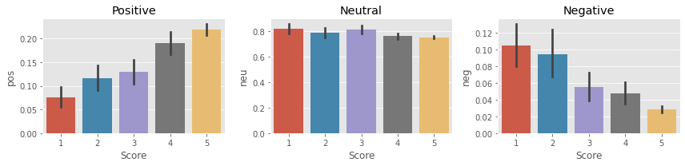

# AmazonReviewsSentimentAnalysis

In this small side project I compared two different sentiment analysis models over a dataset of 50 000 amazon food reviews.
- The VADER model from the NLTK library
- Twitter Roberta base sentiment from hugging face 

It was interesting to handle this large chunk of data and compare the efficiency of big pre-trained models to pick the best one.

The result of the first model from NLTK, a lot of mistakes so I decided to try another one.

Comparaison of the two models with a pairplot diagram for seaborn.

